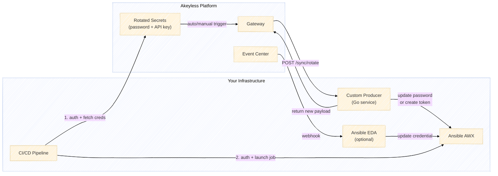
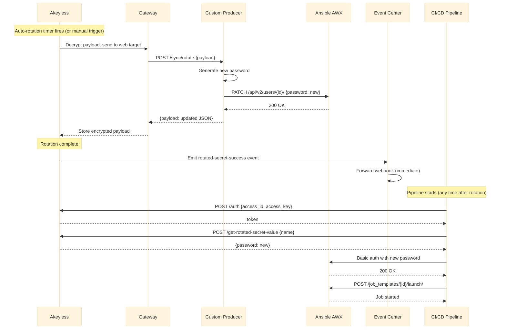
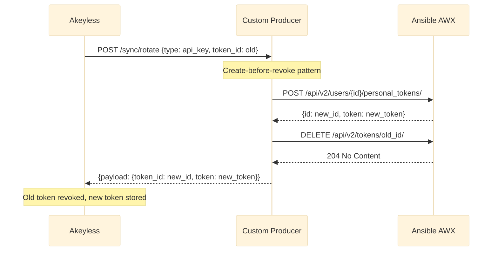

# Ansible Credential Rotation with Akeyless

Automatically rotate Ansible AAP/AWX service account passwords and API tokens using Akeyless rotated secrets. Optionally push rotation notifications to Ansible Event-Driven Automation (EDA) via webhooks so Ansible credential objects stay in sync without a pull-based cron job.

---

## Table of Contents

1. [How It Works](#how-it-works)
2. [Prerequisites](#prerequisites)
3. [Repository Layout](#repository-layout)
4. [Component Overview](#component-overview)
5. [Step 1 - Deploy AWX](#step-1--deploy-awx)
6. [Step 2 - Deploy the Custom Producer](#step-2--deploy-the-custom-producer)
7. [Step 3 - Configure Akeyless](#step-3--configure-akeyless)
8. [Step 4 - Run the CI/CD Pipeline](#step-4--run-the-cicd-pipeline)
9. [Step 5 - Enable Event-Driven Push (Optional)](#step-5--enable-event-driven-push-optional)
10. [Step 6 - Validate](#step-6--validate)
11. [Operations Guide](#operations-guide)
12. [Troubleshooting](#troubleshooting)

---

## How It Works

Akeyless manages the full lifecycle of Ansible credentials. Rather than storing passwords in a vault and hoping someone remembers to rotate them, Akeyless owns the rotation schedule, calls out to a lightweight custom producer to perform the actual credential change on AWX, and stores the result encrypted using Distributed Fragments Cryptography. Pipelines and automation never hold long-lived credentials - they fetch the current value from Akeyless at runtime, every time.

### Architecture



The Akeyless Gateway sits between the platform and your infrastructure. When a rotation is due, the gateway sends the current encrypted payload to the custom producer. The producer is a stateless Go service - it generates a new credential, applies it to AWX via the AWX API, and returns the updated payload for Akeyless to re-encrypt and store. Nothing is persisted on the producer side.

On the consumer side, CI/CD pipelines authenticate to Akeyless with an API key, fetch the latest rotated value, and use it to authenticate to AWX. If Ansible EDA is deployed, Akeyless can also push a webhook notification the moment a rotation completes, so Ansible credential objects update immediately without waiting for a scheduled pull.

### Rotation Schedule

Rotation is controlled entirely within Akeyless. When you create a rotated secret, you set two parameters:

- **`rotation-interval`** - how often the secret rotates, in days (1-365). The default in this project is **7 days**.
- **`auto-rotate`** - whether Akeyless rotates on schedule (`true`) or only when you trigger it manually (`false`).

These are set at creation time in `akeyless-setup/setup.sh` and can be changed later:

```bash
# Change to daily rotation
akeyless update-rotated-secret \
  --name /Ansible/Credentials/server-build-svc \
  --rotation-interval 1

# Or disable auto-rotation entirely (manual only)
akeyless update-rotated-secret \
  --name /Ansible/Credentials/server-build-svc \
  --auto-rotate false
```

You can also trigger an immediate rotation at any time without waiting for the schedule:

```bash
akeyless rotated-secret rotate --name /Ansible/Credentials/server-build-svc
```

The rotation interval, last rotation time, and next scheduled rotation are all visible in the Akeyless Console under the item details, or via CLI:

```bash
akeyless describe-item --name /Ansible/Credentials/server-build-svc
```

### Password Rotation Flow



When the rotation interval elapses, Akeyless decrypts the stored payload and sends it through the gateway to the custom producer. The producer generates a cryptographically random 24-character password, calls the AWX REST API to update the target user's password, and returns the updated payload. Akeyless re-encrypts it and stores the new version. The old password is immediately invalidated on AWX - there is no window where both old and new credentials are valid.

After the rotation succeeds, Akeyless Event Center can fire a webhook to notify downstream systems. Pipelines don't depend on the webhook - they always fetch the current credential from Akeyless at execution time, so they automatically pick up whatever the latest rotated value is.

### API Key Rotation Flow



API token rotation uses a create-before-revoke pattern. The producer first creates a new personal access token on AWX, confirms it was issued, and only then revokes the old one. This ensures there is no gap where no valid token exists. If the old token has already expired or been manually revoked, the delete is best-effort and the rotation still succeeds.

### Supported Credential Types

| Type | What rotates | How it's applied to AWX |
|------|-------------|------------------------|
| `password` | User login password | `PATCH /api/v2/users/{id}/` - immediate, old password invalidated |
| `api_key` | Personal access token | Create new token, then revoke old - no downtime window |

---

## Prerequisites

| Requirement | Details |
|-------------|---------|
| **Kubernetes cluster** | Any cluster (EKS, GKE, MicroK8s, etc.), or a single Linux machine where K3s will be installed. See Step 1 for both options. |
| **Akeyless Gateway** | Deployed in the cluster and accessible. Needs an API key auth method. |
| **Akeyless CLI** | Installed and authenticated (`akeyless auth`). |
| **Docker** | For building the custom producer image. |
| **kubectl** | Configured to talk to your cluster. |
| **Container registry** | Any registry accessible from the cluster (e.g., Docker Hub, local registry). |
| **DNS** | DNS records for AWX and the custom producer hostnames, resolving to your ingress IP. |

---

## Repository Layout

```
.
├── kubernetes/awx/                 # AWX deployment (operator + instance)
│   ├── kustomization.yaml          #   Kustomize overlay for AWX operator v2.19.1
│   ├── awx-instance.yaml           #   AWX custom resource (replicas, ingress, storage)
│   └── certificate.yaml            #   TLS certificate (cert-manager)
│
├── custom-producer/                # Go service implementing Akeyless custom producer protocol
│   ├── main.go                     #   HTTP server, auth middleware, webhook receiver
│   ├── internal/ansible/client.go  #   AWX API client (password, token, credential ops)
│   ├── internal/producer/producer.go  # Rotation logic for password + API key types
│   ├── internal/producer/types.go  #   Request/response structs and payload definitions
│   ├── Dockerfile                  #   Multi-stage build (Go → Alpine)
│   ├── docker-compose.yml          #   Docker Compose deployment (alternative to K8s)
│   ├── .env.example                #   Example env vars for Docker Compose
│   └── kubernetes/deployment.yaml  #   K8s Deployment + Service + Ingress + Secret
│
├── akeyless-setup/
│   └── setup.sh                    # Creates Akeyless web target, rotated secrets, webhook forwarder
│
├── ansible/
│   ├── playbooks/demo/
│   │   ├── server-build.yml        #   Demo job that runs in AWX (simulates server provisioning)
│   │   └── verify-rotation.yml     #   Tests rotation by authenticating with current creds
│   ├── playbooks/
│   │   ├── fetch-credentials.yml   #   Pull model: fetch creds from Akeyless on a schedule
│   │   ├── update-credential.yml   #   Push model: called by EDA on rotation webhook
│   │   ├── update-single-credential.yml
│   │   └── notify-rotation-failure.yml
│   ├── eda/rulebooks/
│   │   └── akeyless-rotation.yml   #   EDA rulebook: listens for webhooks, triggers playbooks
│   ├── collections/requirements.yml
│   └── inventory/group_vars/all.yml
│
├── cicd/
│   ├── pipeline-server-build.sh    # Pipeline script: Akeyless auth → fetch creds → AWX job
│   └── e2e-test.sh                 # End-to-end validation (rotation + auth + pipeline)
│
├── .github/workflows/
│   └── server-build.yml            # GitHub Actions workflow (calls pipeline-server-build.sh)
│
├── .env                            # Local environment variables (git-ignored)
└── .gitignore
```

---

## Component Overview

### Custom Producer

A stateless Go HTTP service that the Akeyless Gateway calls when a rotation is triggered. It implements three endpoints:

| Endpoint | When called | What it does |
|----------|------------|-------------|
| `POST /sync/rotate` | On each rotation (auto or manual) | Generates new password or API token, updates AWX user via API, returns updated payload |
| `POST /sync/create` | When a consumer reads the secret | Returns the current credentials from the payload |
| `POST /sync/revoke` | On revocation (unused for rotated secrets) | Acknowledges and returns |
| `POST /webhook/rotation-event` | On Event Center webhook delivery | Logs the event (replace with your EDA integration) |
| `GET /health` | K8s liveness/readiness probes | Returns `ok` |

**Environment variables:**

| Variable | Required | Description |
|----------|----------|-------------|
| `PORT` | No | Listen port (default: `8080`) |
| `AKEYLESS_ACCESS_ID` | Yes | Gateway access ID for JWT validation |
| `SKIP_AUTH` | No | Set to `true` to disable auth (testing only) |

### Akeyless Rotated Secrets

Each rotated secret stores an encrypted JSON payload that the custom producer needs to perform the rotation. The payload includes the AWX admin credentials and the target user details. On each rotation:

1. Akeyless decrypts the payload and sends it to the custom producer.
2. The producer performs the rotation and returns the updated payload.
3. Akeyless re-encrypts and stores the new payload.

No secrets are stored outside Akeyless. The custom producer is stateless.

### Pipeline Script

`cicd/pipeline-server-build.sh` is a self-contained bash script that any CI/CD system can call. It:

1. Authenticates to Akeyless with an API key
2. Fetches the current (rotated) password from Akeyless
3. Authenticates to AWX with that password
4. Launches a job template and waits for completion

It requires `AKEYLESS_ACCESS_ID` and `AKEYLESS_ACCESS_KEY` environment variables.

---

## Step 1 - Deploy AWX

AWX is the open-source upstream of Ansible Automation Platform. Skip this step if you already have an AAP/AWX instance.

AWX requires Kubernetes. If you don't have a cluster, Option B below walks you through a single-machine setup using K3s.

### Option A: Existing Kubernetes Cluster

Use this if you already have a running cluster with an ingress controller and cert-manager.

#### 1.1 Create the namespace

```bash
kubectl create namespace ansible
```

#### 1.2 Create a DNS record

Add a DNS A record for your AWX hostname (e.g., `ansible.example.com`) pointing to your cluster's ingress IP.

#### 1.3 Edit the AWX configuration

Edit `kubernetes/awx/awx-instance.yaml`:

```yaml
spec:
  hostname: ansible.example.com          # your hostname
  ingress_class_name: nginx              # your ingress class (nginx, traefik, etc.)
  ingress_tls_secret: awx-tls
  ingress_annotations: |
    cert-manager.io/cluster-issuer: your-cluster-issuer  # your cert issuer
```

> **Storage class:** The manifest omits `postgres_storage_class` and `projects_storage_class` so Kubernetes uses your cluster's default StorageClass. If you need a specific one (e.g., `gp2` on EKS, `standard` on GKE), uncomment and set those fields in `awx-instance.yaml`.

Edit `kubernetes/awx/certificate.yaml`:

```yaml
spec:
  issuerRef:
    name: your-cluster-issuer             # your cert issuer
  dnsNames:
    - ansible.example.com                 # your hostname
```

#### 1.4 Deploy

```bash
kubectl apply -k kubernetes/awx/
```

The AWX operator CRD needs a moment to register. If you see `no matches for kind "AWX"`, wait 30 seconds and re-apply:

```bash
kubectl wait --for=condition=Established crd/awxs.awx.ansible.com --timeout=60s
kubectl apply -f kubernetes/awx/awx-instance.yaml
```

#### 1.5 Wait for readiness

```bash
kubectl get pods -n ansible -w
```

Wait until `awx-web`, `awx-task`, and `awx-postgres` are all Running.

#### 1.6 Get the admin password

```bash
kubectl get secret awx-admin-password -n ansible -o jsonpath='{.data.password}' | base64 -d; echo
```

#### 1.7 Verify access

```bash
curl -sk -u "admin:<password>" "https://ansible.example.com/api/v2/ping/"
```

### Option B: Single Machine with K3s

Use this if you don't have a Kubernetes cluster. K3s is a lightweight, single-binary Kubernetes distribution that runs on any Linux machine. It includes an ingress controller (Traefik) out of the box.

**Requirements:** Linux host with at least 4 GB RAM and 2 CPUs.

#### 1.1 Install K3s

```bash
curl -sfL https://get.k3s.io | sh -

# Make kubectl available to your user
mkdir -p ~/.kube
sudo cp /etc/rancher/k3s/k3s.yaml ~/.kube/config
sudo chown $(id -u):$(id -g) ~/.kube/config
export KUBECONFIG=~/.kube/config
```

Verify the cluster is running:

```bash
kubectl get nodes
```

#### 1.2 Install cert-manager

```bash
kubectl apply -f https://github.com/cert-manager/cert-manager/releases/latest/download/cert-manager.yaml
kubectl wait --for=condition=Available deployment/cert-manager -n cert-manager --timeout=120s
```

Create a self-signed issuer for TLS:

```bash
cat <<EOF | kubectl apply -f -
apiVersion: cert-manager.io/v1
kind: ClusterIssuer
metadata:
  name: selfsigned-issuer
spec:
  selfSigned: {}
EOF
```

#### 1.3 Set your hostname

If you don't have DNS, add an entry to `/etc/hosts` on any machine that needs to reach AWX:

```bash
echo "<k3s-host-ip> ansible.example.com" | sudo tee -a /etc/hosts
```

#### 1.4 Edit the AWX configuration

Edit `kubernetes/awx/awx-instance.yaml`:
- Set `hostname` to `ansible.example.com` (or whatever you chose)
- Change `ingress_class_name` from `nginx` to `traefik` (K3s ships Traefik by default)

Edit `kubernetes/awx/certificate.yaml`:
- Set the cert-manager issuer to `selfsigned-issuer`

#### 1.5 Deploy AWX

```bash
kubectl create namespace ansible
kubectl apply -k kubernetes/awx/

# Wait for the CRD, then apply the instance
kubectl wait --for=condition=Established crd/awxs.awx.ansible.com --timeout=60s
kubectl apply -f kubernetes/awx/awx-instance.yaml
```

> **Known issue — kube-rbac-proxy image pull failure:** AWX Operator v2.19.1 references a `kube-rbac-proxy` image that may fail to pull on some clusters. If the operator pod stays in `ImagePullBackOff`, run:
>
> ```bash
> kubectl patch deployment awx-operator-controller-manager -n ansible \
>   --type='json' \
>   -p='[{"op": "replace", "path": "/spec/template/spec/containers/0/image", "value":"registry.k8s.io/kubebuilder/kube-rbac-proxy:v0.16.0"}]'
> ```

#### 1.6 Wait for readiness

```bash
kubectl get pods -n ansible -w
```

This takes a few minutes on a fresh machine. Wait until `awx-web`, `awx-task`, and `awx-postgres` are all Running.

#### 1.7 Get the admin password and verify

```bash
AWX_PASS=$(kubectl get secret awx-admin-password -n ansible -o jsonpath='{.data.password}' | base64 -d)
echo "Admin password: ${AWX_PASS}"
curl -sk -u "admin:${AWX_PASS}" "https://ansible.example.com/api/v2/ping/"
```

### 1.8 Create the service account

Create the user that your pipelines will authenticate as:

```bash
AWX_URL="https://ansible.example.com"
AWX_PASS="<admin password from step 1.6>"

curl -sk -u "admin:${AWX_PASS}" -X POST "${AWX_URL}/api/v2/users/" \
  -H "Content-Type: application/json" \
  -d '{
    "username": "svc-server-build",
    "password": "InitialTempPassword123!",
    "first_name": "Server Build",
    "last_name": "Service Account",
    "is_superuser": false
  }'
```

Note the user `id` from the response — you'll need it for the Akeyless payload in Step 3.

### 1.9 Create the organization, project, inventory, and job template

These AWX objects are required before you can run the demo pipeline.

```bash
AWX_URL="https://ansible.example.com"
AWX_PASS="<admin password from step 1.6 or 1.7>"

# Create an organization
ORG_ID=$(curl -sk -u "admin:${AWX_PASS}" -X POST "${AWX_URL}/api/v2/organizations/" \
  -H "Content-Type: application/json" \
  -d '{"name": "Demo", "description": "Demo organization for credential rotation"}' \
  | jq -r '.id')
echo "Organization ID: ${ORG_ID}"

# Grant the service account access to the organization
SVC_USER_ID="<user id from step 1.8>"
curl -sk -u "admin:${AWX_PASS}" -X POST \
  "${AWX_URL}/api/v2/organizations/${ORG_ID}/users/" \
  -H "Content-Type: application/json" \
  -d "{\"id\": ${SVC_USER_ID}}"

# Make the service account an admin of the org (so it can launch jobs)
curl -sk -u "admin:${AWX_PASS}" -X POST \
  "${AWX_URL}/api/v2/organizations/${ORG_ID}/admins/" \
  -H "Content-Type: application/json" \
  -d "{\"id\": ${SVC_USER_ID}}"

# Create a project (SCM-based, pointing to this repo)
PROJECT_ID=$(curl -sk -u "admin:${AWX_PASS}" -X POST "${AWX_URL}/api/v2/projects/" \
  -H "Content-Type: application/json" \
  -d "{
    \"name\": \"Credential Rotation Demo\",
    \"organization\": ${ORG_ID},
    \"scm_type\": \"git\",
    \"scm_url\": \"https://github.com/Fahmy-Kadiri-akl/ansible-credential-rotation.git\",
    \"scm_branch\": \"main\",
    \"scm_update_on_launch\": true
  }" | jq -r '.id')
echo "Project ID: ${PROJECT_ID}"

# Wait for the initial project sync to finish
echo "Waiting for project sync..."
for i in $(seq 1 30); do
  STATUS=$(curl -sk -u "admin:${AWX_PASS}" "${AWX_URL}/api/v2/projects/${PROJECT_ID}/" | jq -r '.status')
  if [ "$STATUS" = "successful" ]; then echo "  Project synced."; break; fi
  sleep 2
done

# Create an inventory
INV_ID=$(curl -sk -u "admin:${AWX_PASS}" -X POST "${AWX_URL}/api/v2/inventories/" \
  -H "Content-Type: application/json" \
  -d "{
    \"name\": \"Local\",
    \"organization\": ${ORG_ID}
  }" | jq -r '.id')
echo "Inventory ID: ${INV_ID}"

# Add localhost to the inventory
curl -sk -u "admin:${AWX_PASS}" -X POST "${AWX_URL}/api/v2/inventories/${INV_ID}/hosts/" \
  -H "Content-Type: application/json" \
  -d '{"name": "localhost", "variables": "ansible_connection: local"}'

# Create the job template
JT_ID=$(curl -sk -u "admin:${AWX_PASS}" -X POST "${AWX_URL}/api/v2/job_templates/" \
  -H "Content-Type: application/json" \
  -d "{
    \"name\": \"Server Build\",
    \"organization\": ${ORG_ID},
    \"project\": ${PROJECT_ID},
    \"inventory\": ${INV_ID},
    \"playbook\": \"ansible/playbooks/demo/server-build.yml\",
    \"ask_variables_on_launch\": true
  }" | jq -r '.id')
echo "Job Template ID: ${JT_ID}"

echo ""
echo "AWX setup complete. Summary:"
echo "  Organization:  ${ORG_ID}"
echo "  Project:       ${PROJECT_ID}"
echo "  Inventory:     ${INV_ID}"
echo "  Job Template:  ${JT_ID}"
echo "  Service User:  ${SVC_USER_ID}"
```

> **Tip:** Save the service account user ID (`SVC_USER_ID`) — you'll need it when configuring the Akeyless rotated secret payloads in Step 3.

---

## Step 2 - Deploy the Custom Producer

You can deploy the custom producer using **Kubernetes** or **Docker Compose**.

### Option A: Kubernetes

#### 2.1 Pull or build the image

A pre-built public image is available on GitHub Container Registry:

```
ghcr.io/fahmy-kadiri-akl/ansible-cred-producer:latest
```

The default Kubernetes manifest already references this image — no build step needed.

If you fork this repo and want your own image, the **Publish Custom Producer Image** GitHub Actions workflow automatically builds and pushes to GHCR on any push to `main` that changes `custom-producer/`. Or build manually:

```bash
cd custom-producer
docker build -t <your-registry>/ansible-cred-producer:latest .
docker push <your-registry>/ansible-cred-producer:latest
```

#### 2.2 Edit the Kubernetes manifest

Edit `custom-producer/kubernetes/deployment.yaml`:

- If you built your own image, update the `image` field to your registry path
- Set the `akeyless-access-id` in the Secret to your Akeyless Gateway access ID
- Set the ingress `host` to your hostname (e.g., `ansible-producer.example.com`)
- Set the cert-manager issuer annotation to match your cluster

#### 2.3 Create a DNS record

Add a DNS A record for the producer hostname pointing to your ingress IP.

#### 2.4 Deploy

```bash
kubectl apply -f custom-producer/kubernetes/deployment.yaml
```

#### 2.5 Verify

```bash
curl -sk https://ansible-producer.example.com/health
# Should return: ok
```

### Option B: Docker Compose

Use this if you don't have a Kubernetes cluster or want a quick standalone deployment.

#### 2.1 Configure

```bash
cd custom-producer
cp .env.example .env
# Edit .env - set AKEYLESS_ACCESS_ID to your gateway's access ID
```

#### 2.2 Start

```bash
docker compose up -d
```

#### 2.3 Verify

```bash
curl http://localhost:8080/health
# Should return: ok
```

#### 2.4 Note on networking

When using Docker Compose, the Akeyless Gateway must be able to reach the producer over the network. If your gateway runs in K8s but the producer runs on a standalone host, make sure port 8080 is accessible and set the Akeyless Web Target URL to `http://<host-ip>:8080/sync/rotate`.

If both the gateway and producer run on the same Docker host, use `http://ansible-cred-producer:8080/sync/rotate` in the web target and connect them to the same Docker network.

---

## Step 3 - Configure Akeyless

This step creates the web target, rotated secrets, and webhook forwarder in Akeyless.

### 3.1 Authenticate the CLI

```bash
akeyless auth --access-id <your-access-id> --access-key <your-access-key> --access-type api_key
```

### 3.2 Edit the setup script

Open `akeyless-setup/setup.sh` and set the variables at the top:

| Variable | Description |
|----------|-------------|
| `GATEWAY_URL` | Your Akeyless Gateway URL (port 8000) |
| `PRODUCER_URL` | Internal K8s service URL for the custom producer |
| `ANSIBLE_URL` | AWX controller URL (internal K8s service or external) |
| `ANSIBLE_ADMIN_USER` | AWX admin username |
| `ANSIBLE_ADMIN_PASSWORD` | AWX admin password |
| `TARGET_USERNAME` | The AWX service account to rotate (e.g., `svc-server-build`) |
| `TARGET_INITIAL_PASSWORD` | Its current password |
| `EDA_WEBHOOK_URL` | (Optional) Ansible EDA webhook endpoint |
| `EDA_WEBHOOK_TOKEN` | (Optional) Bearer token for the EDA endpoint |

### 3.3 Run the setup

```bash
chmod +x akeyless-setup/setup.sh
./akeyless-setup/setup.sh
```

This creates:

- **Web Target** (`/Ansible/Credentials/ansible-producer-target`) - points to the custom producer
- **Rotated Secret** (`/Ansible/Credentials/server-build-svc`) - password rotation, 7-day interval
- **Rotated Secret** (`/Ansible/Credentials/api-token-eda`) - API token rotation, 7-day interval
- **Event Forwarder** (`ansible-eda-rotation-forwarder`) - webhook on rotation events

### 3.4 Test a manual rotation

```bash
akeyless rotated-secret rotate --name /Ansible/Credentials/server-build-svc
```

Then verify the new value:

```bash
akeyless get-rotated-secret-value --name /Ansible/Credentials/server-build-svc
```

The returned payload should contain a new `password` field, and that password should work when authenticating to AWX.

---

## Step 4 - Run the CI/CD Pipeline

The pipeline script simulates what a real CI/CD system (GitHub Actions, GitLab CI, Jenkins) would do.

### 4.1 Set environment variables

```bash
export AKEYLESS_ACCESS_ID="p-your-access-id"
export AKEYLESS_ACCESS_KEY="your-access-key"
export AWX_URL="https://ansible.example.com"
```

### 4.2 Run the pipeline

```bash
./cicd/pipeline-server-build.sh "my-server-01" "webserver"
```

Output:

```
[1/5] Authenticating to Akeyless...
[2/5] Fetching rotated credentials from Akeyless...
[3/5] Authenticating to AWX as 'svc-server-build'...
[4/5] Launching job template 'Server Build'...
[5/5] Waiting for job to complete...
  PIPELINE RESULT: SUCCESS
```

### 4.3 GitHub Actions

The `.github/workflows/server-build.yml` workflow wraps this script. Add these repository secrets:

- `AKEYLESS_ACCESS_ID`
- `AKEYLESS_ACCESS_KEY`

Then trigger via **Actions > Server Build Pipeline > Run workflow**.

---

## Step 5 - Enable Event-Driven Push (Optional)

By default, pipelines fetch credentials from Akeyless at runtime (pull model). If you also want Ansible credential objects to update automatically when a rotation happens, deploy Ansible EDA.

### 5.1 Install collections

```bash
ansible-galaxy collection install -r ansible/collections/requirements.yml
```

### 5.2 Start the EDA rulebook

```bash
ansible-rulebook \
  --rulebook ansible/eda/rulebooks/akeyless-rotation.yml \
  -i ansible/inventory/ \
  -e eda_webhook_token="<your-webhook-token>" \
  -e akeyless_access_id="<your-access-id>" \
  -e akeyless_access_key="<your-access-key>" \
  -e controller_password="<awx-admin-password>"
```

This listens on port 5000 for webhooks from the Akeyless Event Center. When a rotation succeeds, it runs `update-credential.yml` which fetches the new value and updates the corresponding Ansible credential object.

### 5.3 Webhook payload format

Akeyless Event Center sends:

```json
[{
  "item_name": "/Ansible/Credentials/server-build-svc",
  "item_type": "ROTATED_SECRET",
  "event_type": "rotated-secret-success",
  "payload": {
    "event_message": "/Ansible/Credentials/server-build-svc has been successfully rotated"
  }
}]
```

The EDA rulebook routes `rotated-secret-success` events to the update playbook and `rotated-secret-failure` events to a notification playbook.

---

## Step 6 - Validate

Run the end-to-end test suite:

```bash
export AKEYLESS_ACCESS_ID="p-your-access-id"
export AKEYLESS_ACCESS_KEY="your-access-key"
./cicd/e2e-test.sh
```

The test suite validates:

1. Akeyless authentication works
2. Current rotated secret is readable
3. Manual rotation triggers successfully
4. Password actually changed (new != old)
5. New password authenticates against AWX
6. Old password is rejected by AWX
7. Full CI/CD pipeline succeeds with rotated credentials

All 7 tests must pass for a healthy deployment.

---

## Operations Guide

### Adding a new credential to rotate

1. Create the user in AWX.
2. Build a payload JSON matching the `password` or `api_key` type (see `custom-producer/internal/producer/types.go` for the schema).
3. Create a new rotated secret in Akeyless with that payload:

```bash
akeyless rotated-secret create custom \
  --name "/Ansible/Credentials/<new-secret-name>" \
  --gateway-url "<gateway-url>" \
  --target-name "/Ansible/Credentials/ansible-producer-target" \
  --authentication-credentials use-user-creds \
  --rotator-type custom \
  --custom-payload '<json-payload>' \
  --auto-rotate true \
  --rotation-interval 7
```

4. If using EDA push model, add the new secret to `credential_map` in `ansible/playbooks/update-credential.yml`.

### Updating the custom producer

```bash
cd custom-producer
docker build -t <registry>/ansible-cred-producer:latest .
docker push <registry>/ansible-cred-producer:latest
kubectl rollout restart deployment/ansible-cred-producer -n ansible
```

---

## Troubleshooting

| Symptom | Cause | Fix |
|---------|-------|-----|
| Rotation returns 404 | Web target URL doesn't include `/sync/rotate` | Update web target: `akeyless target update web --name <target> --url <producer-url>/sync/rotate` |
| Rotation returns 401 | Gateway access ID mismatch | Verify `AKEYLESS_ACCESS_ID` env var in the producer matches the gateway's access ID |
| Pipeline fails at step 3 | Password is stale or rotation failed | Check rotation status: `akeyless describe-item --name <secret>` and producer logs: `kubectl logs -n ansible deployment/ansible-cred-producer` |
| Webhook not received | Event forwarder misconfigured | Verify: `akeyless event-forwarder-get --name ansible-eda-rotation-forwarder` |
| AWX user lookup fails | `target_user_id` is 0 and username doesn't match | Set `target_user_id` explicitly in the payload, or verify the username exists in AWX |
| `SKIP_AUTH=true` in production | Auth is disabled | Remove `SKIP_AUTH` env var: `kubectl set env deployment/ansible-cred-producer -n ansible SKIP_AUTH-` |
| AWX operator pod `ImagePullBackOff` | `kube-rbac-proxy` image reference is stale | Patch the image: `kubectl patch deployment awx-operator-controller-manager -n ansible --type='json' -p='[{"op": "replace", "path": "/spec/template/spec/containers/0/image", "value":"registry.k8s.io/kubebuilder/kube-rbac-proxy:v0.16.0"}]'` |
| K3s ingress not routing traffic | AWX manifest uses `nginx` but K3s ships `traefik` | Change `ingress_class_name` to `traefik` in `awx-instance.yaml` |
