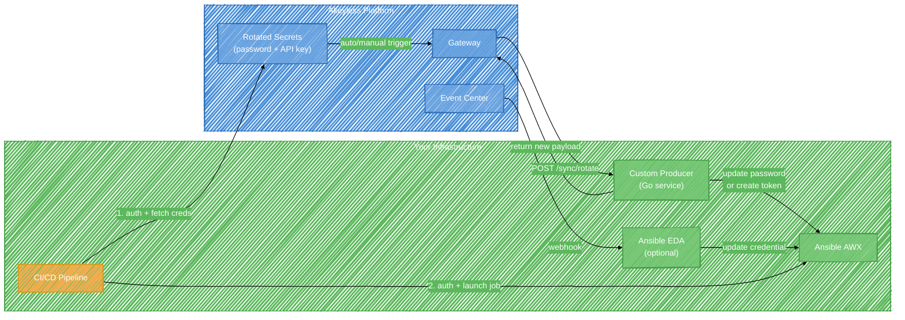
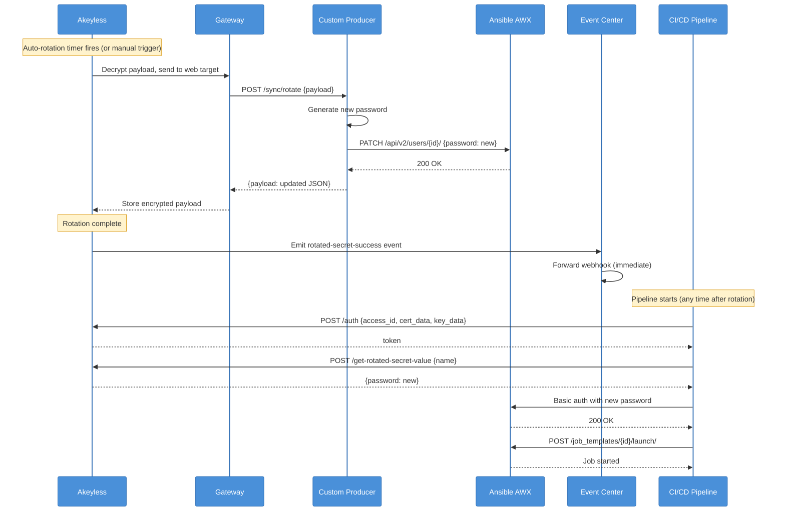
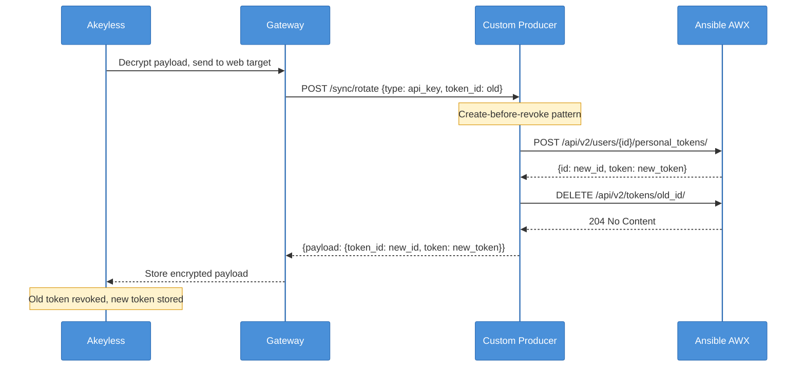

# Ansible Credential Rotation with Akeyless

Automatically rotate Ansible AAP/AWX service account passwords and API tokens using Akeyless rotated secrets. Optionally push rotation notifications to Ansible Event-Driven Automation (EDA) via webhooks so Ansible credential objects stay in sync without a pull-based cron job.

---

## Table of Contents

1. [The Problem](#the-problem)
2. [What This Solves](#what-this-solves)
3. [How It Works](#how-it-works)
4. [Prerequisites](#prerequisites)
5. [Repository Layout](#repository-layout)
6. [Component Overview](#component-overview)
7. [Step 1 - Deploy AWX](#step-1--deploy-awx)
8. [Step 2 - Deploy the Custom Producer](#step-2--deploy-the-custom-producer)
9. [Step 3 - Configure Akeyless](#step-3--configure-akeyless)
10. [Step 4 - Run the CI/CD Pipeline](#step-4--run-the-cicd-pipeline)
11. [Step 5 - Enable Event-Driven Push (Optional)](#step-5--enable-event-driven-push-optional)
12. [Step 6 - Enable Email Notifications (Optional)](#step-6--enable-email-notifications-optional)
13. [Step 7 - Validate](#step-7--validate)
14. [Operations Guide](#operations-guide)
15. [Troubleshooting](#troubleshooting)

---

## The Problem

Ansible Automation Platform (AAP) and AWX have no built-in mechanism for rotating service account credentials. In practice, this means:

- **CI/CD pipelines authenticate to Ansible with static passwords or API keys.** These credentials are created once, stored in a vault or CI secret, and rarely changed. When they are changed, it's a manual process - update the password in Ansible, then go update every consumer that uses it, and hope nothing breaks in between.

- **API keys are generated manually and never rotated.** As more teams adopt Ansible for automation, each team needs API keys for their integrations. There's no standard process for generating, rotating, or revoking these keys. They accumulate, go stale, and become a security liability.

- **Credential sync is poll-based and fragile.** Organizations typically set up a scheduled job (e.g., a Monday morning cron) that pulls credentials from a vault and pushes them into Ansible. If the rotation happens after the sync, the credentials are stale until the next scheduled run. If the sync job fails silently, pipelines fail at the worst possible time.

- **No one knows when credentials were last rotated.** Without automation, rotation depends on someone remembering to do it. Audit questions like "when was this service account password last changed?" have no reliable answer.

These problems compound as the Ansible environment scales. One or two service accounts are manageable. Dozens across multiple teams, each with their own API keys and automation pipelines, are not.

## What This Solves

This repository provides a complete, working solution for automated Ansible credential rotation:

| Problem | Solution |
|---------|----------|
| Passwords and API keys are never rotated | Akeyless rotates them automatically on a configurable schedule (e.g., every 7 days) |
| Rotation is manual and error-prone | A stateless custom producer handles the rotation end-to-end - generate new credential, apply it to Ansible, return it to Akeyless for encrypted storage |
| Consumers break when credentials change | Pipelines fetch the current credential from Akeyless at runtime, every time. They never hold a stale copy. |
| Credential sync is delayed | Event-driven push via webhooks updates Ansible credential objects immediately when a rotation happens - no cron, no delay |
| No visibility into rotation status | Akeyless tracks rotation history, schedules, and failures. Email/Slack/Teams notifications alert on success or failure. |
| API keys accumulate and are never revoked | API token rotation uses a create-before-revoke pattern - the old token is automatically deleted after the new one is confirmed |

The result is that teams can onboard to Ansible automation with a standard, secure credential lifecycle already in place - rather than figuring it out after the fact.

---

## How It Works

Akeyless manages the full lifecycle of Ansible credentials. Rather than storing passwords in a vault and hoping someone remembers to rotate them, Akeyless owns the rotation schedule, calls out to a lightweight custom producer to perform the actual credential change on AWX, and stores the result encrypted using Distributed Fragments Cryptography. Pipelines and automation never hold long-lived credentials - they fetch the current value from Akeyless at runtime, every time.

### Architecture


```mermaid
---
config:
  look: handDrawn
  theme: base
  themeVariables:
    primaryColor: "#4A90D9"
    primaryTextColor: "#fff"
    primaryBorderColor: "#2D6CB4"
    secondaryColor: "#5CB85C"
    secondaryTextColor: "#fff"
    secondaryBorderColor: "#449D44"
    tertiaryColor: "#F0AD4E"
    tertiaryTextColor: "#fff"
    tertiaryBorderColor: "#D9960A"
---
graph LR
    subgraph Akeyless["Akeyless Platform"]
        RS["Rotated Secrets<br/>(password + API key)"]
        GW["Gateway"]
        EC["Event Center"]
    end

    subgraph Infra["Your Infrastructure"]
        CP["Custom Producer<br/>(Go service)"]
        AWX["Ansible AWX"]
        EDA["Ansible EDA<br/>(optional)"]
        CICD["CI/CD Pipeline"]
    end

    RS -- "auto/manual trigger" --> GW
    GW -- "POST /sync/rotate" --> CP
    CP -- "update password<br/>or create token" --> AWX
    CP -- "return new payload" --> GW

    EC -- "webhook" --> EDA
    EDA -- "update credential" --> AWX

    CICD -- "1. auth + fetch creds" --> RS
    CICD -- "2. auth + launch job" --> AWX

    style Akeyless fill:#4A90D9,stroke:#2D6CB4,color:#fff
    style Infra fill:#5CB85C,stroke:#449D44,color:#fff
    style RS fill:#6BA4E0,stroke:#2D6CB4,color:#fff
    style GW fill:#6BA4E0,stroke:#2D6CB4,color:#fff
    style EC fill:#6BA4E0,stroke:#2D6CB4,color:#fff
    style CP fill:#78C878,stroke:#449D44,color:#fff
    style AWX fill:#78C878,stroke:#449D44,color:#fff
    style EDA fill:#78C878,stroke:#449D44,color:#fff
    style CICD fill:#F0AD4E,stroke:#D9960A,color:#fff
```

The Akeyless Gateway sits between the platform and your infrastructure. When a rotation is due, the gateway sends the current encrypted payload to the custom producer. The producer is a stateless Go service - it generates a new credential, applies it to AWX via the AWX API, and returns the updated payload for Akeyless to re-encrypt and store. Nothing is persisted on the producer side.

On the consumer side, CI/CD pipelines authenticate to Akeyless with a client certificate, fetch the latest rotated value, and use it to authenticate to AWX. If Ansible EDA is deployed, Akeyless can also push a webhook notification the moment a rotation completes, so Ansible credential objects update immediately without waiting for a scheduled pull.

### Rotation Schedule

Rotation is controlled entirely within Akeyless. When you create a rotated secret, you set two parameters:

- **`rotation-interval`** - how often the secret rotates, in days (1-365). The default in this project is **7 days**.
- **`auto-rotate`** - whether Akeyless rotates on schedule (`true`) or only when you trigger it manually (`false`).

These are set at creation time in `akeyless-setup/setup.sh` and can be changed later:

```bash
# Change to daily rotation
akeyless rotated-secret update custom \
  --name /Ansible/Credentials/server-build-svc \
  --gateway-url "${AKEYLESS_GATEWAY_URL}" \
  --rotation-interval 1

# Or disable auto-rotation entirely (manual only)
akeyless rotated-secret update custom \
  --name /Ansible/Credentials/server-build-svc \
  --gateway-url "${AKEYLESS_GATEWAY_URL}" \
  --auto-rotate false
```

You can also trigger an immediate rotation at any time without waiting for the schedule:

```bash
akeyless gateway-rotate-secret \
  --name /Ansible/Credentials/server-build-svc \
  --gateway-url "${AKEYLESS_GATEWAY_URL}"
```

The rotation interval, last rotation time, and next scheduled rotation are all visible in the Akeyless Console under the item details, or via CLI:

```bash
akeyless describe-item --name /Ansible/Credentials/server-build-svc
```

### Password Rotation Flow


```mermaid
---
config:
  look: handDrawn
  theme: base
  themeVariables:
    actorBkg: "#4A90D9"
    actorTextColor: "#fff"
    actorBorder: "#2D6CB4"
    signalColor: "#333"
    noteBkgColor: "#FFF3CD"
    noteBorderColor: "#D9960A"
    noteTextColor: "#333"
---
sequenceDiagram
    participant AKL as Akeyless
    participant GW as Gateway
    participant CP as Custom Producer
    participant AWX as Ansible AWX
    participant EC as Event Center
    participant CICD as CI/CD Pipeline

    Note over AKL: Auto-rotation timer fires (or manual trigger)

    AKL->>GW: Decrypt payload, send to web target
    GW->>CP: POST /sync/rotate {payload}
    CP->>CP: Generate new password
    CP->>AWX: PATCH /api/v2/users/{id}/ {password: new}
    AWX-->>CP: 200 OK
    CP-->>GW: {payload: updated JSON}
    GW-->>AKL: Store encrypted payload

    Note over AKL: Rotation complete

    AKL->>EC: Emit rotated-secret-success event
    EC->>EC: Forward webhook (immediate)

    Note over CICD: Pipeline starts (any time after rotation)

    CICD->>AKL: POST /auth {access_id, cert_data, key_data}
    AKL-->>CICD: token
    CICD->>AKL: POST /get-rotated-secret-value {name}
    AKL-->>CICD: {password: new}
    CICD->>AWX: Basic auth with new password
    AWX-->>CICD: 200 OK
    CICD->>AWX: POST /job_templates/{id}/launch/
    AWX-->>CICD: Job started
```

When the rotation interval elapses, Akeyless decrypts the stored payload and sends it through the gateway to the custom producer. The producer generates a cryptographically random 24-character password, calls the AWX REST API to update the target user's password, and returns the updated payload. Akeyless re-encrypts it and stores the new version. The old password is immediately invalidated on AWX - there is no window where both old and new credentials are valid.

After the rotation succeeds, Akeyless Event Center can fire a webhook to notify downstream systems. Pipelines don't depend on the webhook - they always fetch the current credential from Akeyless at execution time, so they automatically pick up whatever the latest rotated value is.

### API Key Rotation Flow


```mermaid
---
config:
  look: handDrawn
  theme: base
  themeVariables:
    actorBkg: "#4A90D9"
    actorTextColor: "#fff"
    actorBorder: "#2D6CB4"
    signalColor: "#333"
    noteBkgColor: "#FFF3CD"
    noteBorderColor: "#D9960A"
    noteTextColor: "#333"
---
sequenceDiagram
    participant AKL as Akeyless
    participant GW as Gateway
    participant CP as Custom Producer
    participant AWX as Ansible AWX

    AKL->>GW: Decrypt payload, send to web target
    GW->>CP: POST /sync/rotate {type: api_key, token_id: old}

    Note over CP: Create-before-revoke pattern

    CP->>AWX: POST /api/v2/users/{id}/personal_tokens/
    AWX-->>CP: {id: new_id, token: new_token}
    CP->>AWX: DELETE /api/v2/tokens/old_id/
    AWX-->>CP: 204 No Content
    CP-->>GW: {payload: {token_id: new_id, token: new_token}}
    GW-->>AKL: Store encrypted payload

    Note over AKL: Old token revoked, new token stored
```

API token rotation uses a create-before-revoke pattern. The producer first creates a new personal access token on AWX, confirms it was issued, and only then revokes the old one. This ensures there is no gap where no valid token exists. If the old token has already expired or been manually revoked, the delete is best-effort and the rotation still succeeds.

### Supported Credential Types

| Type | What rotates | How it's applied to AWX |
|------|-------------|------------------------|
| `password` | User login password | `PATCH /api/v2/users/{id}/` - immediate, old password invalidated |
| `api_key` | Personal access token | Create new token, then revoke old - no downtime window |

---

## Prerequisites

| Requirement | Details |
|-------------|---------|
| **Kubernetes cluster** | Any cluster (EKS, GKE, MicroK8s, etc.), or a single Linux machine where K3s will be installed. See Step 1 for both options. |
| **Akeyless Gateway** | Deployed in the cluster and accessible. Needs a certificate auth method - see the [Certificate Auth Guide](https://github.com/Fahmy-Kadiri-akl/akeyless-certificate-auth). |
| **Akeyless CLI** | Optional. Used by `akeyless-setup/setup.sh` and for manual operations. Not a runtime dependency - the pipeline and custom producer use the REST API directly via `curl`. All setup steps can also be done through the Akeyless Console UI. |
| **kubectl** | v1.14+ (includes built-in kustomize via `kubectl apply -k`). Configured to talk to your cluster. |
| **Docker** | Only if building the custom producer image yourself. A pre-built public image is available on GHCR. |
| **jq + curl** | Used by the setup, pipeline, and E2E test scripts. |
| **DNS** | DNS records for AWX and the custom producer hostnames, resolving to your ingress IP. |

### Minimum Akeyless Permissions

The access ID used for rotation needs both **RBAC permissions** on the secret path and **Gateway Allowed Access** permissions. Without both, commands like `gateway-rotate-secret` will fail.

#### RBAC (Access Role)

Grant these capabilities on the `/Ansible/Credentials/` path (or wherever your rotated secrets live):

| Capability | Required for |
|------------|-------------|
| `read` | Fetching the current rotated secret value (`rotated-secret get-value`) |
| `update` | Triggering rotation (`gateway-rotate-secret`), updating secret config |
| `create` | Initial secret creation (`rotated-secret create custom`) |
| `list` | Listing secrets in the folder (`rotated-secret list`) |

```bash
akeyless set-role-rule \
  --role-name "/Ansible/CredentialRotationRole" \
  --path "/Ansible/Credentials/*" \
  --capability read,update,create,list
```

#### Gateway Allowed Access

The access ID must also be granted permissions on the Gateway itself. Without these, the Gateway will reject rotation requests even if RBAC is correct.

| Gateway Permission | Required for |
|--------------------|-------------|
| `rotated_secret` | Managing rotated secret configuration on the Gateway |
| `rotate_secret_value` | Triggering the actual rotation (`gateway-rotate-secret`) |
| `event_forwarding` | Creating Event Center webhook forwarders (optional, for EDA push model) |
| `targets` | Creating and managing web targets |

```bash
akeyless gateway-create-allowed-access \
  --name "credential-rotation-access" \
  --access-id "p-your-access-id" \
  --permissions rotated_secret,rotate_secret_value,targets,event_forwarding \
  --gateway-url "${AKEYLESS_GATEWAY_URL}"
```

> **Common failure:** If `gateway-rotate-secret` returns `404` or `permission denied`, the most likely cause is a missing Gateway Allowed Access entry. RBAC alone is not sufficient - the access ID must be explicitly granted `rotate_secret_value` on the Gateway.

---

## Repository Layout

```
.
├── kubernetes/awx/                 # AWX deployment (operator + instance)
│   ├── kustomization.yaml          #   Kustomize overlay for AWX operator v2.19.1
│   ├── awx-instance.yaml           #   AWX custom resource (replicas, ingress, storage)
│   └── certificate.yaml            #   TLS certificate (cert-manager)
│
├── kubernetes/custom-producer/      # K8s manifests for deploying the custom producer
│   └── deployment.yaml             #   Deployment + Service + Secret (uses external image)
│
├── akeyless-setup/
│   └── setup.sh                    # Creates Akeyless web target, rotated secrets, webhook forwarder
│
├── ansible/
│   ├── playbooks/demo/
│   │   ├── server-build.yml        #   Demo job that runs in AWX (simulates server provisioning)
│   │   └── verify-rotation.yml     #   Tests rotation by authenticating with current creds
│   ├── playbooks/
│   │   ├── fetch-credentials.yml   #   Pull model: fetch creds from Akeyless on a schedule
│   │   ├── update-credential.yml   #   Push model: called by EDA on rotation webhook
│   │   ├── update-single-credential.yml
│   │   └── notify-rotation-failure.yml
│   ├── eda/rulebooks/
│   │   └── akeyless-rotation.yml   #   EDA rulebook: listens for webhooks, triggers playbooks
│   ├── collections/requirements.yml
│   └── inventory/group_vars/all.yml
│
├── cicd/
│   ├── pipeline-server-build.sh    # Pipeline script: Akeyless auth → fetch creds → AWX job
│   └── e2e-test.sh                 # End-to-end validation (rotation + auth + pipeline)
│
├── .github/workflows/
│   └── server-build.yml            # GitHub Actions workflow (calls pipeline-server-build.sh)
│
├── .env                            # Local environment variables (git-ignored)
└── .gitignore
```

> **Note:** The custom producer source code lives in a separate repository:
> [github.com/Fahmy-Kadiri-akl/custom-producer](https://github.com/Fahmy-Kadiri-akl/custom-producer).
> This repo deploys the pre-built container image from that project.

---

## Component Overview

### Custom Producer

This project uses the [custom-producer](https://github.com/Fahmy-Kadiri-akl/custom-producer) - a single container that rotates credentials across 19+ target systems. The `type` field in the Akeyless payload dispatches to the correct handler. For Ansible, the relevant types are `password` and `api_key`.

The pre-built image is available at:

```
ghcr.io/fahmy-kadiri-akl/custom-producer/rotator:latest
```

It implements three endpoints for the Akeyless custom producer protocol:

| Endpoint | When called | What it does |
|----------|------------|-------------|
| `POST /sync/rotate` | On each rotation (auto or manual) | Generates new password or API token, updates AWX user via API, returns updated payload |
| `POST /sync/create` | When a consumer reads the secret | Returns the current credentials from the payload |
| `POST /sync/revoke` | On revocation (unused for rotated secrets) | Acknowledges and returns |
| `POST /webhook/rotation-event` | On Event Center webhook delivery | Logs the event (replace with your EDA integration) |
| `GET /health` | K8s liveness/readiness probes | Returns `ok` |

**Environment variables:**

| Variable | Required | Description |
|----------|----------|-------------|
| `PORT` | No | Listen port (default: `8080`) |
| `AKEYLESS_ACCESS_ID` | Yes | Gateway access ID for JWT validation |
| `SKIP_AUTH` | No | Set to `true` to disable auth (testing only) |

### Akeyless Rotated Secrets

Each rotated secret stores an encrypted JSON payload that the custom producer needs to perform the rotation. The payload includes the AWX admin credentials and the target user details. On each rotation:

1. Akeyless decrypts the payload and sends it to the custom producer.
2. The producer performs the rotation and returns the updated payload.
3. Akeyless re-encrypts and stores the new payload.

No secrets are stored outside Akeyless. The custom producer is stateless.

### Pipeline Script

`cicd/pipeline-server-build.sh` is a self-contained bash script that any CI/CD system can call. It:

1. Authenticates to Akeyless with a client certificate
2. Fetches the current (rotated) password from Akeyless
3. Authenticates to AWX with that password
4. Launches a job template and waits for completion

It requires `AKEYLESS_ACCESS_ID`, `AKEYLESS_CERT_DATA`, and `AKEYLESS_KEY_DATA` environment variables.

---

## Step 1 - Deploy AWX

AWX is the open-source upstream of Ansible Automation Platform. Skip this step if you already have an AAP/AWX instance.

AWX requires Kubernetes. If you don't have a cluster, Option B below walks you through a single-machine setup using K3s.

### Option A: Existing Kubernetes Cluster

Use this if you already have a running cluster with an ingress controller and cert-manager.

#### 1.1 Create the namespace

```bash
kubectl create namespace ansible
```

#### 1.2 Create a DNS record

Add a DNS A record for your AWX hostname (e.g., `ansible.example.com`) pointing to your cluster's ingress IP.

> **Important - hostname conflicts:** If you're using an nginx ingress controller and other services already run on this cluster, AWX **must have its own unique hostname**. Nginx routes by hostname - if two ingresses share the same host and path, one will shadow the other. For example, if your Akeyless Gateway is already on `gateway.example.com`, give AWX a different hostname like `ansible.example.com`. Do **not** reuse the gateway's hostname.
>
> To check for conflicts:
>
> ```bash
> kubectl get ingress --all-namespaces -o custom-columns='NAMESPACE:.metadata.namespace,NAME:.metadata.name,HOST:.spec.rules[*].host'
> ```

#### 1.3 Edit the AWX configuration

Edit `kubernetes/awx/awx-instance.yaml`:

```yaml
spec:
  hostname: ansible.example.com          # your hostname
  ingress_class_name: nginx              # your ingress class - see cloud-specific notes below
  ingress_tls_secret: awx-tls
  ingress_annotations: |
    cert-manager.io/cluster-issuer: your-cluster-issuer  # your cert issuer
```

> **Storage class:** The manifest omits `postgres_storage_class` and `projects_storage_class` so Kubernetes uses your cluster's default StorageClass. If you need a specific one (e.g., `gp2` on EKS, `standard` on GKE), uncomment and set those fields in `awx-instance.yaml`.

**Cloud-specific ingress class:**

| Cloud / Platform | `ingress_class_name` | Notes |
|------------------|----------------------|-------|
| **GKE / GCE** | `gce` | Provisions a Google Cloud HTTP(S) Load Balancer with a public IP |
| **EKS** | `alb` | Requires the AWS Load Balancer Controller; use annotation `alb.ingress.kubernetes.io/scheme: internet-facing` |
| **AKS** | `nginx` | Azure ships an nginx ingress add-on; alternatively use `azure/application-gateway` |
| **K3s** | `traefik` | Included by default |
| **MicroK8s** | `nginx` | Enable with `microk8s enable ingress` |
| **Self-managed nginx** | `nginx` | Ensure the controller service is `type: LoadBalancer` for external access |

For **GCE/GKE**, after deploying the AWX instance the ingress takes 2–3 minutes to provision a load balancer. Watch for the external IP:

```bash
kubectl get ingress -n ansible -w
# Wait until the ADDRESS column shows a public IP
```

Then create a DNS A record pointing your hostname to that IP.

> **Tip:** If you already deployed with the wrong ingress class (e.g., nginx showing `127.0.0.1` on GCE), fix it in-place:
>
> ```bash
> kubectl delete ingress awx-ingress -n ansible
> kubectl patch awx awx -n ansible --type=merge -p '{
>   "spec": {
>     "ingress_class_name": "gce",
>     "hostname": "your-hostname.example.com"
>   }
> }'
> ```
>
> The operator will recreate the ingress with the correct class.

Edit `kubernetes/awx/certificate.yaml`:

```yaml
spec:
  issuerRef:
    name: your-cluster-issuer             # your cert issuer
  dnsNames:
    - ansible.example.com                 # your hostname
```

#### 1.4 Deploy

Deploy in two steps - the operator must register its CRD before the AWX instance can be created:

```bash
# Step 1: Deploy the AWX Operator
kubectl apply -k kubernetes/awx/

# Step 2: Wait for the CRD, then create the AWX instance
kubectl wait --for=condition=Established crd/awxs.awx.ansible.com --timeout=120s
kubectl apply -f kubernetes/awx/awx-instance.yaml
```

#### 1.5 Wait for readiness

```bash
kubectl get pods -n ansible -w
```

Wait until `awx-web`, `awx-task`, and `awx-postgres` are all Running.

#### 1.6 Get the admin password

```bash
kubectl get secret awx-admin-password -n ansible -o jsonpath='{.data.password}' | base64 -d; echo
```

#### 1.7 Verify access

```bash
curl -sk -u "admin:<password>" "https://ansible.example.com/api/v2/ping/"
```

### Option B: Single Machine with K3s

Use this if you don't have a Kubernetes cluster. K3s is a lightweight, single-binary Kubernetes distribution that runs on any Linux machine. It includes an ingress controller (Traefik) out of the box.

**Requirements:** Linux host with at least 4 GB RAM and 2 CPUs.

#### 1.1 Install K3s

```bash
curl -sfL https://get.k3s.io | sh -

# Make kubectl available to your user
mkdir -p ~/.kube
sudo cp /etc/rancher/k3s/k3s.yaml ~/.kube/config
sudo chown $(id -u):$(id -g) ~/.kube/config
export KUBECONFIG=~/.kube/config
```

Verify the cluster is running:

```bash
kubectl get nodes
```

#### 1.2 Install cert-manager

```bash
kubectl apply -f https://github.com/cert-manager/cert-manager/releases/latest/download/cert-manager.yaml
kubectl wait --for=condition=Available deployment/cert-manager -n cert-manager --timeout=120s
```

Create a self-signed issuer for TLS:

```bash
cat <<EOF | kubectl apply -f -
apiVersion: cert-manager.io/v1
kind: ClusterIssuer
metadata:
  name: selfsigned-issuer
spec:
  selfSigned: {}
EOF
```

#### 1.3 Set your hostname

If you don't have DNS, add an entry to `/etc/hosts` on any machine that needs to reach AWX:

```bash
echo "<k3s-host-ip> ansible.example.com" | sudo tee -a /etc/hosts
```

#### 1.4 Edit the AWX configuration

Edit `kubernetes/awx/awx-instance.yaml`:
- Set `hostname` to `ansible.example.com` (or whatever you chose)
- Change `ingress_class_name` from `nginx` to `traefik` (K3s ships Traefik by default)

Edit `kubernetes/awx/certificate.yaml`:
- Set the cert-manager issuer to `selfsigned-issuer`

#### 1.5 Deploy AWX

```bash
kubectl create namespace ansible
# Step 1: Deploy the AWX Operator
kubectl apply -k kubernetes/awx/

# Step 2: Wait for the CRD, then create the AWX instance
kubectl wait --for=condition=Established crd/awxs.awx.ansible.com --timeout=120s
kubectl apply -f kubernetes/awx/awx-instance.yaml
```

> **Note:** The `kustomization.yaml` includes an image override for `kube-rbac-proxy` to fix a stale image reference in AWX Operator v2.19.1. No manual patching is needed.

#### 1.6 Wait for readiness

```bash
kubectl get pods -n ansible -w
```

This takes a few minutes on a fresh machine. Wait until `awx-web`, `awx-task`, and `awx-postgres` are all Running.

#### 1.7 Get the admin password and verify

```bash
AWX_PASS=$(kubectl get secret awx-admin-password -n ansible -o jsonpath='{.data.password}' | base64 -d)
echo "Admin password: ${AWX_PASS}"
curl -sk -u "admin:${AWX_PASS}" "https://ansible.example.com/api/v2/ping/"
```

### 1.8 Create the service account

Create the user that your pipelines will authenticate as:

```bash
AWX_URL="https://ansible.example.com"
AWX_PASS="<admin password from step 1.6>"

curl -sk -u "admin:${AWX_PASS}" -X POST "${AWX_URL}/api/v2/users/" \
  -H "Content-Type: application/json" \
  -d '{
    "username": "svc-server-build",
    "password": "InitialTempPassword123!",
    "first_name": "Server Build",
    "last_name": "Service Account",
    "is_superuser": false
  }'
```

Note the user `id` from the response - you'll need it for the Akeyless payload in Step 3.

### 1.9 Create the organization, project, inventory, and job template

These AWX objects are required before you can run the demo pipeline.

```bash
AWX_URL="https://ansible.example.com"
AWX_PASS="<admin password from step 1.6 or 1.7>"

# Create an organization
ORG_ID=$(curl -sk -u "admin:${AWX_PASS}" -X POST "${AWX_URL}/api/v2/organizations/" \
  -H "Content-Type: application/json" \
  -d '{"name": "Demo", "description": "Demo organization for credential rotation"}' \
  | jq -r '.id')
echo "Organization ID: ${ORG_ID}"

# Grant the service account access to the organization
SVC_USER_ID="<user id from step 1.8>"
curl -sk -u "admin:${AWX_PASS}" -X POST \
  "${AWX_URL}/api/v2/organizations/${ORG_ID}/users/" \
  -H "Content-Type: application/json" \
  -d "{\"id\": ${SVC_USER_ID}}"

# Make the service account an admin of the org (so it can launch jobs)
curl -sk -u "admin:${AWX_PASS}" -X POST \
  "${AWX_URL}/api/v2/organizations/${ORG_ID}/admins/" \
  -H "Content-Type: application/json" \
  -d "{\"id\": ${SVC_USER_ID}}"

# Create a project (SCM-based, pointing to this repo)
PROJECT_ID=$(curl -sk -u "admin:${AWX_PASS}" -X POST "${AWX_URL}/api/v2/projects/" \
  -H "Content-Type: application/json" \
  -d "{
    \"name\": \"Credential Rotation Demo\",
    \"organization\": ${ORG_ID},
    \"scm_type\": \"git\",
    \"scm_url\": \"https://github.com/Fahmy-Kadiri-akl/ansible-credential-rotation.git\",
    \"scm_branch\": \"main\",
    \"scm_update_on_launch\": true
  }" | jq -r '.id')
echo "Project ID: ${PROJECT_ID}"

# Wait for the initial project sync to finish
echo "Waiting for project sync..."
for i in $(seq 1 30); do
  STATUS=$(curl -sk -u "admin:${AWX_PASS}" "${AWX_URL}/api/v2/projects/${PROJECT_ID}/" | jq -r '.status')
  if [ "$STATUS" = "successful" ]; then echo "  Project synced."; break; fi
  sleep 2
done

# Create an inventory
INV_ID=$(curl -sk -u "admin:${AWX_PASS}" -X POST "${AWX_URL}/api/v2/inventories/" \
  -H "Content-Type: application/json" \
  -d "{
    \"name\": \"Local\",
    \"organization\": ${ORG_ID}
  }" | jq -r '.id')
echo "Inventory ID: ${INV_ID}"

# Add localhost to the inventory
curl -sk -u "admin:${AWX_PASS}" -X POST "${AWX_URL}/api/v2/inventories/${INV_ID}/hosts/" \
  -H "Content-Type: application/json" \
  -d '{"name": "localhost", "variables": "ansible_connection: local"}'

# Create the job template
JT_ID=$(curl -sk -u "admin:${AWX_PASS}" -X POST "${AWX_URL}/api/v2/job_templates/" \
  -H "Content-Type: application/json" \
  -d "{
    \"name\": \"Server Build\",
    \"organization\": ${ORG_ID},
    \"project\": ${PROJECT_ID},
    \"inventory\": ${INV_ID},
    \"playbook\": \"ansible/playbooks/demo/server-build.yml\",
    \"ask_variables_on_launch\": true
  }" | jq -r '.id')
echo "Job Template ID: ${JT_ID}"

echo ""
echo "AWX setup complete. Summary:"
echo "  Organization:  ${ORG_ID}"
echo "  Project:       ${PROJECT_ID}"
echo "  Inventory:     ${INV_ID}"
echo "  Job Template:  ${JT_ID}"
echo "  Service User:  ${SVC_USER_ID}"
```

> **Tip:** Save the service account user ID (`SVC_USER_ID`) - you'll need it when configuring the Akeyless rotated secret payloads in Step 3.

---

## Step 2 - Deploy the Custom Producer

The custom producer is maintained in a separate repository: [Fahmy-Kadiri-akl/custom-producer](https://github.com/Fahmy-Kadiri-akl/custom-producer). It is a single container that rotates credentials across 19+ target systems - for this project, the relevant types are `password` and `api_key`.

You can deploy it using **Kubernetes** or **Docker**.

### Option A: Kubernetes

#### 2.1 Edit the Kubernetes manifest

Edit `kubernetes/custom-producer/deployment.yaml`:

- Set the `akeyless-access-id` in the Secret to your Akeyless Gateway access ID

#### 2.2 Deploy

```bash
kubectl apply -f kubernetes/custom-producer/deployment.yaml
```

#### 2.3 Verify

```bash
kubectl run curl-test --rm -it --restart=Never --image=curlimages/curl -- \
  curl -s http://rotator.rotator.svc.cluster.local:8080/health
# Should return: ok
```

### Option B: Docker

Use this if you don't have a Kubernetes cluster or want a quick standalone deployment.

#### 2.1 Start

```bash
docker run -d --name rotator \
  -p 8080:8080 \
  -e SKIP_AUTH=true \
  ghcr.io/fahmy-kadiri-akl/custom-producer/rotator:latest
```

> Set `SKIP_AUTH=true` only for initial testing. For production, set `AKEYLESS_ACCESS_ID` to your gateway's access ID and remove `SKIP_AUTH`.

#### 2.2 Verify

```bash
curl http://localhost:8080/health
# Should return: ok
```

#### 2.3 Note on networking

When using Docker, the Akeyless Gateway must be able to reach the producer over the network. If your gateway runs in K8s but the producer runs on a standalone host, make sure port 8080 is accessible and set the Akeyless Web Target URL to `http://<host-ip>:8080`.

If both the gateway and producer run on the same Docker host, connect them to the same Docker network.

---

## Step 3 - Configure Akeyless

This step creates the web target, rotated secrets, and webhook forwarder in Akeyless.

### 3.1 Authenticate the CLI

```bash
akeyless auth --access-id <your-access-id> --access-type cert \
  --cert-file-name /path/to/cert.pem --key-file-name /path/to/key.pem
```

### 3.2 Edit the setup script

Open `akeyless-setup/setup.sh` and set the variables at the top:

| Variable | Description |
|----------|-------------|
| `GATEWAY_URL` | Your Akeyless Gateway URL (port 8000) |
| `PRODUCER_URL` | Internal K8s service URL for the custom producer |
| `ANSIBLE_URL` | AWX controller URL (internal K8s service or external) |
| `ANSIBLE_ADMIN_USER` | AWX admin username |
| `ANSIBLE_ADMIN_PASSWORD` | AWX admin password |
| `TARGET_USERNAME` | The AWX service account to rotate (e.g., `svc-server-build`) |
| `TARGET_INITIAL_PASSWORD` | Its current password |
| `EDA_WEBHOOK_URL` | (Optional) Ansible EDA webhook endpoint |
| `EDA_WEBHOOK_TOKEN` | (Optional) Bearer token for the EDA endpoint |

### 3.3 Run the setup

```bash
chmod +x akeyless-setup/setup.sh
./akeyless-setup/setup.sh
```

This creates:

- **Web Target** (`/Ansible/Credentials/ansible-producer-target`) - points to the custom producer
- **Rotated Secret** (`/Ansible/Credentials/server-build-svc`) - password rotation, 7-day interval
- **Rotated Secret** (`/Ansible/Credentials/api-token-eda`) - API token rotation, 7-day interval
- **Event Forwarder** (`ansible-eda-rotation-forwarder`) - webhook on rotation events

### 3.4 Test a manual rotation

```bash
akeyless gateway-rotate-secret \
  --name /Ansible/Credentials/server-build-svc \
  --gateway-url "${AKEYLESS_GATEWAY_URL}"
```

Then verify the new value:

```bash
akeyless rotated-secret get-value --name /Ansible/Credentials/server-build-svc
```

The returned payload should contain a new `password` field, and that password should work when authenticating to AWX.

---

## Step 4 - Run the CI/CD Pipeline

The pipeline script simulates what a real CI/CD system (GitHub Actions, GitLab CI, Jenkins) would do.

### 4.1 Set environment variables

The pipeline script uses certificate authentication. You need the access ID from your Akeyless certificate auth method, and the client certificate and private key as base64-encoded strings.

> **Setting up certificate auth:** If you haven't set up a certificate auth method yet, follow the [Akeyless Certificate Authentication Guide](https://github.com/Fahmy-Kadiri-akl/akeyless-certificate-auth). It walks through creating the auth method with your existing enterprise CA (Microsoft AD CS, AppViewX, Venafi), Akeyless internal PKI, or self-signed certificates for dev/test.

```bash
export AKEYLESS_ACCESS_ID="p-your-access-id"                     # Certificate auth method access ID
export AKEYLESS_CERT_DATA=$(base64 -w0 /path/to/client-cert.pem) # Base64-encoded client certificate
export AKEYLESS_KEY_DATA=$(base64 -w0 /path/to/client-key.pem)   # Base64-encoded client private key
export AWX_URL="https://ansible.example.com"                     # Your AWX/AAP URL
```

For cloud-based authentication (AWS IAM, Azure AD, GCP, OIDC), see [Using Cloud Identity Instead of Certificates](#44-using-cloud-identity-instead-of-certificates) below.

### 4.2 Run the pipeline

```bash
./cicd/pipeline-server-build.sh "my-server-01" "webserver"
```

Output:

```
[1/5] Authenticating to Akeyless...
[2/5] Fetching rotated credentials from Akeyless...
[3/5] Authenticating to AWX as 'svc-server-build'...
[4/5] Launching job template 'Server Build'...
[5/5] Waiting for job to complete...
  PIPELINE RESULT: SUCCESS
```

### 4.3 GitHub Actions

The `.github/workflows/server-build.yml` workflow wraps this script. Add these repository secrets:

- `AKEYLESS_ACCESS_ID`
- `AKEYLESS_CERT_DATA` (base64-encoded client certificate)
- `AKEYLESS_KEY_DATA` (base64-encoded client private key)

Then trigger via **Actions > Server Build Pipeline > Run workflow**.

### 4.4 Using Cloud Identity Instead of Certificates

The pipeline script authenticates to Akeyless using a client certificate, but you can also use your cloud platform's native identity. The REST API `/auth` endpoint accepts the same `access-type` values as the CLI.

| Auth Method | `access-type` | What replaces cert data | Where the identity comes from |
|-------------|---------------|---------------------------|-------------------------------|
| **Certificate** | `cert` | `cert-data` + `key-data` (base64 PEM) | Client certificate signed by a CA registered in the Akeyless certificate auth method |
| **AWS IAM** | `aws_iam` | `cloud-id` (signed STS request) | EC2 instance profile, ECS task role, or Lambda execution role. Use `akeyless auth --access-type aws_iam --cloud-id $(curl -s http://169.254.169.254/latest/meta-data/iam/info)` or generate via AWS SDK. |
| **Azure AD** | `azure_ad` | `cloud-id` (MSI token) | Managed Identity on the VM, VMSS, or AKS pod. Fetch from `http://169.254.169.254/metadata/identity/oauth2/token`. |
| **GCP IAM** | `gcp` | `cloud-id` (signed JWT) | Service account attached to GCE instance, GKE workload, or Cloud Run service. Fetch from metadata server. |
| **Kubernetes** | `k8s` | `k8s-auth-config-name` + service account token | ServiceAccount token mounted at `/var/run/secrets/kubernetes.io/serviceaccount/token`. Requires a K8s auth method configured in Akeyless pointing to your cluster. |
| **JWT/OIDC** | `jwt` or `oidc` | `jwt` (token string) | GitHub Actions OIDC (`ACTIONS_ID_TOKEN_REQUEST_TOKEN`), GitLab CI `CI_JOB_JWT`, or any OIDC provider. |
| **Universal Identity** | `universal_identity` | `uid-token` | Token issued by Akeyless for on-prem machines without cloud identity. |

**Example - replacing certificate auth with AWS IAM in the pipeline:**

```bash
# Instead of:
#   export AKEYLESS_ACCESS_ID="p-your-access-id"
#   export AKEYLESS_CERT_DATA=$(base64 -w0 cert.pem)
#   export AKEYLESS_KEY_DATA=$(base64 -w0 key.pem)

# Generate the cloud-id (signed GetCallerIdentity request)
CLOUD_ID=$(python3 -c "
import boto3, json, base64
client = boto3.client('sts')
url = 'https://sts.amazonaws.com/?Action=GetCallerIdentity&Version=2011-06-15'
headers = {'Content-Type': 'application/x-www-form-urlencoded; charset=utf-8'}
req = client.generate_presigned_url('get_caller_identity', HttpMethod='GET')
print(base64.b64encode(json.dumps({'sts_url': req}).encode()).decode())
")

# Authenticate
TOKEN=$(curl -sf -X POST "${AKEYLESS_API}/auth" \
  -H "Content-Type: application/json" \
  -d "{
    \"access-id\": \"p-your-aws-access-id\",
    \"access-type\": \"aws_iam\",
    \"cloud-id\": \"${CLOUD_ID}\"
  }" | jq -r '.token')
```

**Example - GitHub Actions with OIDC (no secrets needed):**

```bash
# In your GitHub Actions workflow, add:
#   permissions:
#     id-token: write
#
# Then in the pipeline step:
OIDC_TOKEN=$(curl -sf -H "Authorization: bearer ${ACTIONS_ID_TOKEN_REQUEST_TOKEN}" \
  "${ACTIONS_ID_TOKEN_REQUEST_URL}&audience=akeyless.io" | jq -r '.value')

TOKEN=$(curl -sf -X POST "${AKEYLESS_API}/auth" \
  -H "Content-Type: application/json" \
  -d "{
    \"access-id\": \"p-your-oidc-access-id\",
    \"access-type\": \"jwt\",
    \"jwt\": \"${OIDC_TOKEN}\"
  }" | jq -r '.token')
```

> **Note:** Whichever auth method you use, the access ID must still have the same [RBAC and Gateway permissions](#minimum-akeyless-permissions) documented in the Prerequisites section.

---

## Step 5 - Enable Event-Driven Push (Optional)

By default, pipelines fetch credentials from Akeyless at runtime (pull model). If you also want Ansible credential objects to update automatically when a rotation happens, deploy Ansible EDA.

### 5.1 Install collections

```bash
ansible-galaxy collection install -r ansible/collections/requirements.yml
```

### 5.2 Start the EDA rulebook

```bash
ansible-rulebook \
  --rulebook ansible/eda/rulebooks/akeyless-rotation.yml \
  -i ansible/inventory/ \
  -e eda_webhook_token="<your-webhook-token>" \
  -e akeyless_access_id="<your-access-id>" \
  -e akeyless_cert_file="/path/to/cert.pem" \
  -e akeyless_key_file="/path/to/key.pem" \
  -e controller_password="<awx-admin-password>"
```

This listens on port 5000 for webhooks from the Akeyless Event Center. When a rotation succeeds, it runs `update-credential.yml` which fetches the new value and updates the corresponding Ansible credential object.

### 5.3 Webhook payload format

Akeyless Event Center sends:

```json
[{
  "item_name": "/Ansible/Credentials/server-build-svc",
  "item_type": "ROTATED_SECRET",
  "event_type": "rotated-secret-success",
  "payload": {
    "event_message": "/Ansible/Credentials/server-build-svc has been successfully rotated"
  }
}]
```

The EDA rulebook routes `rotated-secret-success` events to the update playbook and `rotated-secret-failure` events to a notification playbook.

---

## Step 6 - Enable Email Notifications (Optional)

Akeyless Event Center can send email notifications when a rotation succeeds or fails. This is independent of the EDA webhook - you can use one, both, or neither.

### Supported Forwarder Types

| Type | Use case |
|------|----------|
| **Email** | Send notifications directly to one or more email addresses |
| **Slack** | Post to a Slack channel via webhook |
| **Teams** | Post to a Microsoft Teams channel via webhook |
| **Webhook** | Send to any HTTP endpoint (used by EDA in Step 5) |
| **ServiceNow** | Create incidents or events in ServiceNow |

### Available Event Types

These are the event types you can subscribe to. For credential rotation, the two most relevant are `rotated-secret-success` and `rotated-secret-failure`.

| Event Type | Description |
|------------|-------------|
| `rotated-secret-success` | A rotated secret was successfully rotated |
| `rotated-secret-failure` | A rotation attempt failed |
| `next-automatic-rotation` | A scheduled auto-rotation is about to happen |
| `dynamic-secret-failure` | A dynamic secret producer failed |
| `static-secret-updated` | A static secret value was changed |
| `certificate-pending-expiration` | A certificate is approaching expiration |
| `certificate-expired` | A certificate has expired |
| `certificate-provisioning-success` | A certificate was provisioned successfully |
| `certificate-provisioning-failure` | Certificate provisioning failed |
| `auth-method-pending-expiration` | An auth method is approaching expiration |
| `auth-method-expired` | An auth method has expired |
| `multi-auth-failure` | Multiple authentication failures detected |
| `uid-rotation-failure` | Universal Identity token rotation failed |
| `gateway-inactive` | A gateway became inactive |
| `rate-limiting` | API rate limits were hit |

### 6.1 Permissions

Creating an event forwarder requires the **Gateway's own access ID** - the access ID the gateway authenticates with, not a user access ID. This is because the event forwarder is a gateway-level resource.

| Requirement | Details |
|-------------|---------|
| **Gateway access ID** | The `gatewayAccessId` from your Helm values or gateway configuration |
| **Gateway access key** | Stored as a Kubernetes secret (see your Helm values for `gatewayCredentialsExistingSecret`) |
| **Gateway Allowed Access** | The gateway access ID needs `event_forwarding` in its Gateway Allowed Access permissions |
| **RBAC** | The gateway access ID's role needs `read`, `list`, `create` on the event forwarder path |

To retrieve the gateway access key from Kubernetes:

```bash
kubectl get secret <gateway-credentials-secret> -n <gateway-namespace> \
  -o jsonpath='{.data.gateway-access-key}' | base64 -d
```

### 6.2 Create the email forwarder

Authenticate as the gateway access ID, then create the forwarder:

```bash
# Authenticate as the gateway
GW_TOKEN=$(akeyless auth \
  --access-id "<gateway-access-id>" \
  --access-type access_key \
  --access-key "<gateway-access-key>" \
  --json | jq -r '.token')

# Create the email event forwarder
akeyless event-forwarder create email \
  --name "rotation-email-notification" \
  --email-to "you@example.com" \
  --items-event-source-locations "/Ansible/Credentials/*" \
  --event-types rotated-secret-success \
  --event-types rotated-secret-failure \
  --runner-type immediate \
  --gateway-url "${AKEYLESS_GATEWAY_URL}" \
  --token "${GW_TOKEN}"
```

**Parameters:**

| Parameter | Description |
|-----------|-------------|
| `--name` | A unique name for this forwarder |
| `--email-to` | Comma-separated list of recipient email addresses |
| `--items-event-source-locations` | Secret path pattern to watch (e.g., `/Ansible/Credentials/*` for all secrets in that folder) |
| `--event-types` | Which events trigger a notification. Repeat the flag for multiple types. |
| `--runner-type` | `immediate` sends on each event. `periodic` batches events and sends every `--every` hours. |
| `--gateway-url` | Your Akeyless Gateway URL |
| `--token` | Auth token from the gateway access ID |

> **Note:** The `--event-types` flag must be repeated for each type - comma-separated values in a single flag are not accepted by the CLI.

### 6.3 Verify the forwarder

```bash
akeyless event-forwarder get \
  --name "rotation-email-notification" \
  --token "${GW_TOKEN}" \
  --json
```

### 6.4 Test with a manual rotation

Trigger a rotation and check your inbox:

```bash
akeyless gateway-rotate-secret \
  --name /Ansible/Credentials/server-build-svc \
  --gateway-url "${AKEYLESS_GATEWAY_URL}" \
  --token "${GW_TOKEN}"
```

You should receive an email at the configured address within a few seconds of the rotation completing.

### 6.5 Managing the forwarder

```bash
# Update recipients or event types
akeyless event-forwarder update email \
  --name "rotation-email-notification" \
  --email-to "you@example.com,team@example.com" \
  --event-types rotated-secret-success \
  --event-types rotated-secret-failure \
  --event-types next-automatic-rotation \
  --token "${GW_TOKEN}"

# Delete the forwarder
akeyless event-forwarder delete \
  --name "rotation-email-notification" \
  --token "${GW_TOKEN}"
```

### 6.6 Using periodic digests instead of immediate notifications

If you don't want an email on every single rotation, use `--runner-type periodic` with `--every` to batch notifications:

```bash
akeyless event-forwarder create email \
  --name "rotation-daily-digest" \
  --email-to "team@example.com" \
  --items-event-source-locations "/Ansible/Credentials/*" \
  --event-types rotated-secret-success \
  --event-types rotated-secret-failure \
  --runner-type periodic \
  --every 24 \
  --gateway-url "${AKEYLESS_GATEWAY_URL}" \
  --token "${GW_TOKEN}"
```

This sends a single digest email every 24 hours with all rotation events that occurred during that period.

---

## Step 7 - Validate

Run the end-to-end test suite:

```bash
export AKEYLESS_ACCESS_ID="p-your-access-id"
export AKEYLESS_CERT_DATA=$(base64 -w0 /path/to/cert.pem)
export AKEYLESS_KEY_DATA=$(base64 -w0 /path/to/key.pem)
./cicd/e2e-test.sh
```

The test suite validates:

1. Akeyless authentication works
2. Current rotated secret is readable
3. Manual rotation triggers successfully
4. Password actually changed (new != old)
5. New password authenticates against AWX
6. Old password is rejected by AWX
7. Full CI/CD pipeline succeeds with rotated credentials

All 7 tests must pass for a healthy deployment.

---

## Operations Guide

### Adding a new credential to rotate

1. Create the user in AWX.
2. Build a payload JSON matching the `password` or `api_key` type (see the [custom-producer payload reference](https://github.com/Fahmy-Kadiri-akl/custom-producer#payload-reference) for the schema).
3. Create a new rotated secret in Akeyless with that payload:

```bash
akeyless rotated-secret create custom \
  --name "/Ansible/Credentials/<new-secret-name>" \
  --gateway-url "<gateway-url>" \
  --target-name "/Ansible/Credentials/ansible-producer-target" \
  --authentication-credentials use-user-creds \
  --custom-payload '<json-payload>' \
  --auto-rotate true \
  --rotation-interval 7
```

4. If using EDA push model, add the new secret to `credential_map` in `ansible/playbooks/update-credential.yml`.

### Updating the custom producer

The custom producer image is built from [Fahmy-Kadiri-akl/custom-producer](https://github.com/Fahmy-Kadiri-akl/custom-producer). To update to the latest version:

```bash
kubectl rollout restart deployment/rotator -n rotator
```

The deployment uses `imagePullPolicy: Always` by default with the `:latest` tag, so a restart pulls the newest image.

---

## Troubleshooting

### Deployment Issues

| Symptom | Cause | Fix |
|---------|-------|-----|
| AWX operator pod `ImagePullBackOff` | `kube-rbac-proxy` image reference is stale | Fixed automatically by the kustomize image override. If deploying from a custom kustomization, add the image override for `gcr.io/kubebuilder/kube-rbac-proxy` to `registry.k8s.io/kubebuilder/kube-rbac-proxy:v0.16.0` |
| `awx-task` pod stuck in `Init:0/3` for several minutes | Normal - the task pod waits for the migration job to complete before starting | Wait up to 5 minutes. Check migration job: `kubectl get jobs -n ansible` |
| AWX instance not created after `kubectl apply -k` | CRD not yet registered | Run `kubectl wait --for=condition=Established crd/awxs.awx.ansible.com --timeout=120s` then apply the instance: `kubectl apply -f kubernetes/awx/awx-instance.yaml` |
| K3s ingress not routing traffic | AWX manifest uses `nginx` but K3s ships `traefik` | Change `ingress_class_name` to `traefik` in `awx-instance.yaml` |
| AWX ingress shows `127.0.0.1` on GCE/GKE | Using `nginx` class instead of `gce` | Change `ingress_class_name` to `gce` (see cloud-specific table in Step 1.3) |
| AWX unreachable or returns wrong app | Hostname conflict - another ingress uses the same host | AWX needs its own unique hostname. Check with: `kubectl get ingress --all-namespaces -o custom-columns='NS:.metadata.namespace,NAME:.metadata.name,HOST:.spec.rules[*].host'` |
| cert-manager warning about `rotationPolicy` | cert-manager >= v1.18.0 changed the default from `Never` to `Always` | Informational only - no action needed. Add `spec.privateKey.rotationPolicy: Always` to silence the warning |

### Rotation Issues

| Symptom | Cause | Fix |
|---------|-------|-----|
| Rotation returns 404 | Web target URL incorrect | Update web target: `akeyless target update web --name <target> --url <producer-url>` |
| Rotation returns 401 | Gateway access ID mismatch | Verify `AKEYLESS_ACCESS_ID` env var in the producer matches the gateway's access ID |
| Producer returns `missing AkeylessCreds header` | Direct call without Gateway, or `SKIP_AUTH` not set for testing | For testing: `kubectl set env deployment/rotator -n rotator SKIP_AUTH=true`. In production, only the Akeyless Gateway should call the producer. |
| AWX user lookup fails | `target_user_id` is 0 and username doesn't match | Set `target_user_id` explicitly in the payload, or verify the username exists in AWX |
| Webhook not received | Event forwarder misconfigured | Verify: `akeyless event-forwarder get --name ansible-eda-rotation-forwarder` |

### Pipeline Issues

| Symptom | Cause | Fix |
|---------|-------|-----|
| Pipeline fails at step 1 (auth) | Certificate auth misconfigured | Verify `AKEYLESS_CERT_DATA` and `AKEYLESS_KEY_DATA` are base64-encoded with no newlines: `base64 -w0 cert.pem` |
| Pipeline fails at step 3 (AWX auth) | Password is stale or rotation failed | Check rotation status: `akeyless describe-item --name <secret>` and producer logs: `kubectl logs -n rotator deployment/rotator` |
| `SKIP_AUTH=true` in production | Auth is disabled | Remove `SKIP_AUTH` env var: `kubectl set env deployment/rotator -n rotator SKIP_AUTH-` |

### Clean Redeploy

To completely tear down and redeploy AWX from scratch:

```bash
# 1. Delete the AWX instance first (lets operator clean up)
kubectl delete awx awx -n ansible --timeout=60s

# 2. Wait for pods to terminate
kubectl wait --for=delete pod -l app.kubernetes.io/name=awx -n ansible --timeout=120s

# 3. Delete the operator and all resources
kubectl delete -k kubernetes/awx/

# 4. Clean up any remaining resources
kubectl delete pvc --all -n ansible
kubectl delete namespace ansible

# 5. Redeploy
kubectl create namespace ansible
kubectl apply -k kubernetes/awx/
kubectl wait --for=condition=Established crd/awxs.awx.ansible.com --timeout=120s
kubectl apply -f kubernetes/awx/awx-instance.yaml

# 6. Wait for readiness (4-5 minutes)
kubectl get pods -n ansible -w
```
